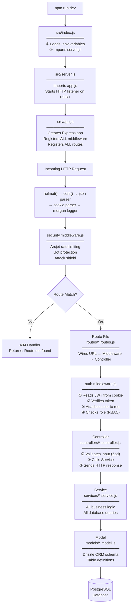
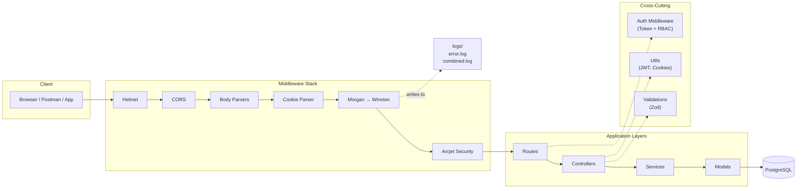
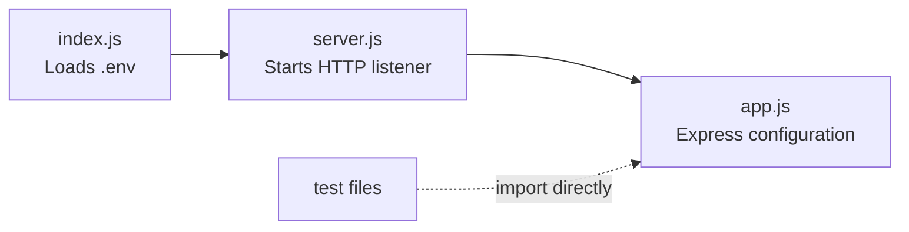
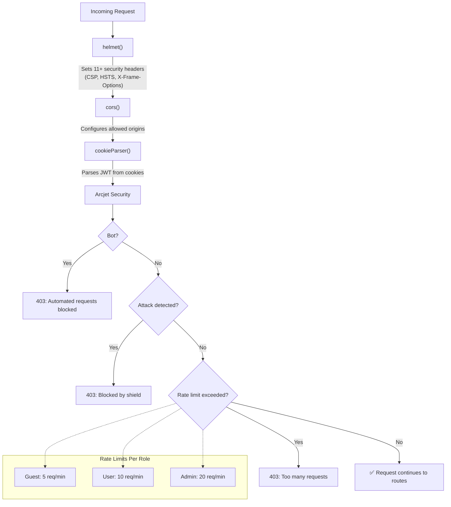
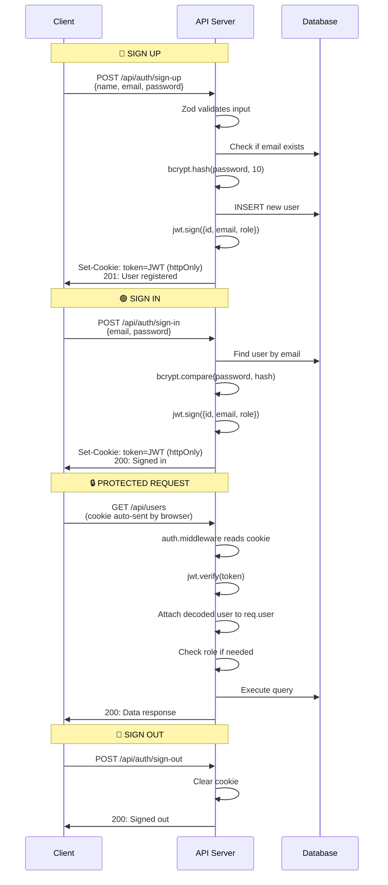
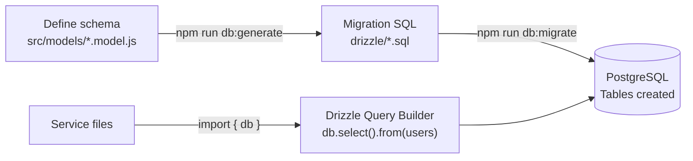
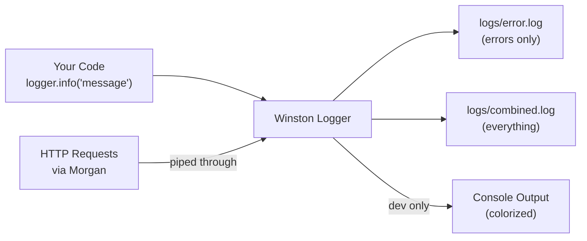
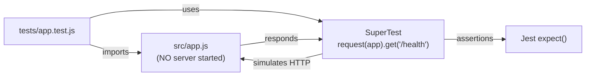
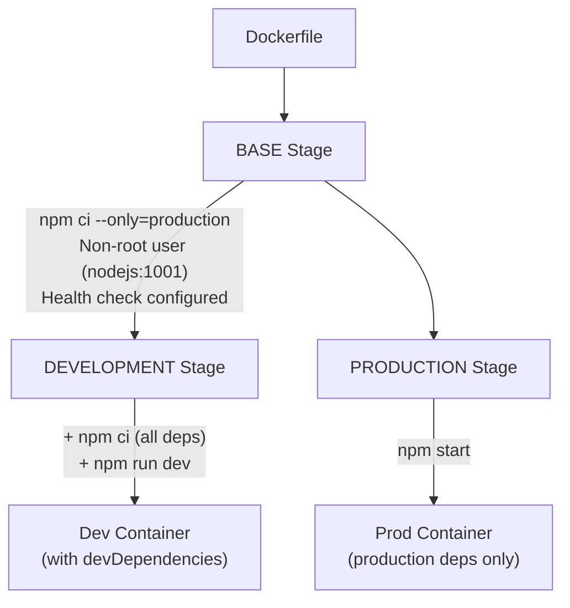
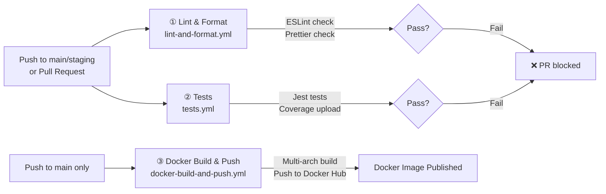

# 🏗️ Professional Node.js/Express API — Project BluePrint

> Your **production-ready starting template** for any Node.js API.  
> Copy it, rename it, fill in your logic — everything is already wired up.

---

## Table of Contents

1. [How to Use This Template](#-how-to-use-this-template)
2. [How the Application Flows](#-how-the-application-flows)
3. [Architecture Overview](#-architecture-overview)
4. [Directory Map — What Every File Does](#-directory-map--what-every-file-does)
5. [Configuration Files — What's Special](#-configuration-files--whats-special)
6. [Source Code Layers Explained](#-source-code-layers-explained)
7. [Security Stack](#-security-stack)
8. [Authentication Flow](#-authentication-flow)
9. [Database & ORM](#-database--orm)
10. [Logging System](#-logging-system)
11. [Validation Pattern](#-validation-pattern)
12. [Testing Setup](#-testing-setup)
13. [Docker Setup](#-docker-setup)
14. [CI/CD Pipelines](#-cicd-pipelines)
15. [What You Need to Change](#-what-you-need-to-change)
16. [All Scripts Reference](#-all-scripts-reference)
17. [Before Going to Production](#-before-going-to-production)

---

## 🚀 How to Use This Template

```bash
# 1. Copy the template
cp -r BluePrint/ ~/projects/my-new-project
cd ~/projects/my-new-project

# 2. Set up environment
cp .env.example .env
# Edit .env with your DATABASE_URL, JWT_SECRET, etc.

# 3. Install & Run
npm install
npm run dev    # Starts with hot reload on http://localhost:3000
```

That's it. Health check, logging, auth, security, linting, testing, Docker, CI/CD — all already configured.

---

## 🛠️ Tech Stack

<p>


</p>

| Category | Technology | Role in This Template |
|----------|-----------|----------------------|
| **Runtime** | Node.js 18+ | JavaScript runtime with native ESM, `--watch` hot reload |
| **Framework** | Express.js 5 | HTTP server, routing, middleware pipeline |
| **Database** | PostgreSQL (Neon) | Primary data store (serverless-compatible) |
| **ORM** | Drizzle ORM | Type-safe schema definitions, migrations, query builder |
| **Auth** | JWT + bcrypt | Token-based authentication with password hashing |
| **Validation** | Zod | Runtime schema validation for all API inputs |
| **Security** | Helmet + CORS + Arcjet | HTTP headers, CORS policy, rate limiting, bot protection |
| **Logging** | Winston + Morgan | Structured app logging + HTTP request logging |
| **Testing** | Jest + SuperTest | Unit/integration testing with HTTP endpoint simulation |
| **Linting** | ESLint (flat config) | Code quality enforcement with modern JS rules |
| **Formatting** | Prettier | Consistent code style across the entire project |
| **Containerization** | Docker | Multi-stage builds with dev/prod targets |
| **Orchestration** | Docker Compose | Dev environment (DB + App) and prod deployment |
| **CI/CD** | GitHub Actions | Automated lint, test, and Docker build+push pipelines |
| **Environment** | dotenv | `.env` file loading for secrets management |

---

## 🔄 How the Application Flows

This is how a request travels through the entire system, file by file:



### The Flow in Plain English

1. **`index.js`** loads your `.env` file, then calls `server.js`
2. **`server.js`** imports the Express app and starts listening on a port
3. **`app.js`** is where everything is assembled — middleware stacks up in order, routes are registered
4. When a **request arrives**, it passes through security middleware (Helmet, CORS, rate limiting) before hitting any route
5. **Route files** are just wiring — they connect a URL path to a controller, optionally through auth/role middleware
6. **Controllers** validate the incoming data with Zod, then delegate to a service
7. **Services** contain the real business logic — they talk to the database using models
8. **Models** define the database table structure using Drizzle ORM

> **Key insight:** Each layer only talks to the layer directly below it. Controllers **never** touch the database. Services **never** send HTTP responses. This separation is what makes the code maintainable and testable.

---

## 🏛️ Architecture Overview



---

## 📁 Directory Map — What Every File Does

```
BluePrint/
│
├── 📄 package.json              ← Dependencies, scripts, ESM mode, path aliases
├── 📄 .env.example              ← Template for env vars (commit this, not .env)
├── 📄 .prettierrc               ← Code formatting rules
├── 📄 .prettierignore           ← Files Prettier should skip
├── 📄 eslint.config.js          ← Linting rules (ESLint flat config)
├── 📄 jest.config.mjs           ← Test runner config (ESM-compatible)
├── 📄 drizzle.config.js         ← Database migration tool config
├── 📄 .gitignore                ← Protects secrets & junk from Git
├── 📄 .dockerignore             ← Keeps Docker images small
├── 🐳 Dockerfile                ← Multi-stage build (dev + prod targets)
├── 🐳 docker-compose.dev.yml    ← Dev environment (DB + app + hot reload)
├── 🐳 docker-compose.prod.yml   ← Prod environment (app only + resource limits)
│
├── src/
│   ├── 📄 index.js              ← THE ENTRY POINT: loads .env → starts server
│   ├── 📄 server.js             ← HTTP listener (separated so tests don't start server)
│   ├── 📄 app.js                ← Express app: middleware + routes + 404 handler
│   │
│   ├── config/
│   │   ├── 📄 database.js       ← Drizzle ORM connection to PostgreSQL
│   │   ├── 📄 logger.js         ← Winston logger (file + console transports)
│   │   └── 📄 arcjet.js         ← Security rules (rate limit, bot detect, shield)
│   │
│   ├── routes/
│   │   ├── 📄 auth.routes.js    ← POST /sign-up, /sign-in, /sign-out
│   │   └── 📄 users.routes.js   ← GET/PUT/DELETE /users, /users/:id
│   │
│   ├── controllers/
│   │   ├── 📄 auth.controller.js   ← Handles auth requests (validate → service → respond)
│   │   └── 📄 users.controller.js  ← Handles user CRUD (validate → service → respond)
│   │
│   ├── services/
│   │   ├── 📄 auth.service.js      ← User creation, password hashing, authentication
│   │   └── 📄 users.service.js     ← Get/update/delete users from database
│   │
│   ├── models/
│   │   └── 📄 user.model.js        ← Database table schema (Drizzle ORM)
│   │
│   ├── middleware/
│   │   ├── 📄 auth.middleware.js      ← JWT verification + role-based access control
│   │   └── 📄 security.middleware.js  ← Arcjet rate limiting per user role
│   │
│   ├── validations/
│   │   ├── 📄 auth.validation.js    ← Zod schemas: signup & signIn bodies
│   │   └── 📄 users.validation.js   ← Zod schemas: user ID param & update body
│   │
│   └── utils/
│       ├── 📄 jwt.js             ← JWT sign/verify wrapper
│       ├── 📄 cookies.js         ← Secure cookie helper (httpOnly, sameSite)
│       └── 📄 format.js          ← Zod error → readable message formatter
│
├── tests/
│   └── 📄 app.test.js           ← Smoke tests: health endpoint, 404 handler
│
├── scripts/
│   ├── 📄 dev.sh                ← Docker dev startup with pre-flight checks
│   └── 📄 prod.sh               ← Docker prod deployment script
│
├── .github/workflows/
│   ├── 📄 lint-and-format.yml        ← CI: runs ESLint + Prettier on every push/PR
│   ├── 📄 tests.yml                  ← CI: runs Jest tests + uploads coverage
│   └── 📄 docker-build-and-push.yml  ← CD: builds Docker image → pushes to Docker Hub
│
├── logs/                        ← Winston writes here (error.log + combined.log)
└── drizzle/                     ← Auto-generated migration SQL files
```

---

## ⚙️ Configuration Files — What's Special

### `package.json` — Three Key Decisions

**① ES Modules throughout:**
```json
"type": "module"
```
The entire project uses `import/export` — no `require()` anywhere. This is the modern standard.

**② Path Aliases (no more `../../../`):**
```json
"imports": {
  "#config/*": "./src/config/*",
  "#controllers/*": "./src/controllers/*",
  "#services/*": "./src/services/*",
  "#utils/*": "./src/utils/*"
}
```
Instead of `import db from '../../../config/database.js'`, you write `import db from '#config/database.js'`. This is **native Node.js** — no Babel, no bundler, no extra tooling.

**③ Native hot reload (no nodemon):**
```json
"dev": "node --watch src/index.js"
```
Since Node.js 18.11+, `--watch` is built in. One less dependency.

---

### `eslint.config.js` — Why It Looks Different

This uses the **new ESLint flat config** format (not the old `.eslintrc`). Key aspects:

- Node.js globals (`process`, `console`, `Buffer`) are explicitly declared because ESM doesn't auto-include them
- Jest globals (`describe`, `it`, `expect`) are scoped **only to test files** — they won't leak into your source code
- Rules enforce modern JS: `prefer-const`, `no-var`, `object-shorthand`, `prefer-arrow-callback`
- Unused variables starting with `_` are allowed (common for Express `_req` or `_next`)

---

### `jest.config.mjs` — Why `.mjs`?

The `.mjs` extension forces Node.js to read this as ESM regardless of other config. Combined with:
```json
"test": "NODE_OPTIONS=--experimental-vm-modules jest"
```
This is the **only way** Jest works with native ES Modules. Without `--experimental-vm-modules`, Jest cannot process `import` statements.

---

### `.env.example` vs `.env`

- `.env.example` — **committed to Git**. Documents every variable your project needs.
- `.env` — **gitignored**. Contains your real secrets. Created by copying `.env.example`.

---

## 🧩 Source Code Layers Explained

### Why `index.js` → `server.js` → `app.js` (Three Files)?



**The critical separation**: `app.js` exports the Express app **without starting a listener**. Tests import `app.js` directly and use SuperTest — no actual server starts, tests run fast, no port conflicts.

If everything was in one file, every test run would start a real HTTP server. This separation is what makes testing work cleanly.

---

### Middleware Order in `app.js` — It Matters!

The middleware is registered in this exact order for a reason:

```
1. helmet()          → Security headers FIRST (before any response goes out)
2. cors()            → CORS headers before any route handler
3. express.json()    → Parse JSON body so routes can read req.body
4. express.urlencoded() → Parse form data
5. cookieParser()    → Parse cookies so auth middleware can read JWT
6. morgan → winston  → Log every request
7. securityMiddleware → Rate limiting AFTER parsing, BEFORE routes
8. routes            → Your actual API endpoints
9. 404 handler       → LAST — catches anything that didn't match
```

If you put `cookieParser()` after the auth middleware, tokens would never be read. If you put the 404 handler before routes, nothing would ever reach your routes.

---

### The Controller Pattern

Every controller follows the same 5-step pattern:

```
① Validate input with Zod (safeParse — doesn't throw)
② Extract validated data
③ Call the service layer (business logic)
④ Handle side effects (set cookies, sign tokens)
⑤ Return structured JSON response
   └── Known errors → specific HTTP status code
   └── Unknown errors → next(e) to Express error handler
```

**Key**: Controllers never touch the database directly. They validate + delegate + respond.

---

### The Service Pattern

Services own all business logic:
- Query/insert/update/delete the database
- Hash passwords, check uniqueness
- Throw **domain-specific errors** (`'User not found'`, `'Email already exists'`)

Controllers catch these errors and translate them to HTTP codes (404, 409, etc.).

---

### The Route Pattern

Routes are **pure wiring** — no logic, just:
```
HTTP Method + URL Path → [Middleware Chain] → Controller Function
```

Protected routes stack middleware:
```
router.delete('/:id', authenticateToken, requireRole(['admin']), deleteUserById);
```
This reads as: "To delete a user, you must have a valid token AND have the admin role."

---

## 🔐 Security Stack



| Layer | What It Does | Package |
|-------|-------------|---------|
| **Helmet** | Sets secure HTTP headers automatically | `helmet` |
| **CORS** | Controls which domains can call your API | `cors` |
| **Cookie Security** | `httpOnly` (no JS access), `secure` (HTTPS only in prod), `sameSite: strict` (CSRF) | `cookie-parser` |
| **Arcjet Shield** | Blocks known attack patterns | `@arcjet/node` |
| **Arcjet Bot Detection** | Blocks automated scrapers (allows search engines) | `@arcjet/node` |
| **Arcjet Rate Limiting** | Different limits based on user role | `@arcjet/node` |
| **bcrypt** | Password hashing with salt (10 rounds) | `bcrypt` |
| **Zod Validation** | Rejects invalid/malicious input before it reaches business logic | `zod` |

> **Note:** Arcjet is optional. If you don't need it, remove `src/config/arcjet.js`, `src/middleware/security.middleware.js`, and the import in `app.js`. You can replace it with a simpler `express-rate-limit` if you prefer.

---

## 🔑 Authentication Flow



**Why cookies instead of `Authorization: Bearer` header?**
- `httpOnly` cookies **cannot be accessed by JavaScript** — prevents XSS attacks from stealing tokens
- `sameSite: strict` prevents CSRF attacks
- Browser sends cookies automatically — no client-side token management needed

---

## 🗃️ Database & ORM

### How Drizzle ORM Works



**Schema = Single source of truth.** You define your tables in `src/models/`, Drizzle generates the SQL automatically. You never write raw migration SQL by hand.

### Key Commands
| Command | What It Does |
|---------|-------------|
| `npm run db:generate` | Reads your models, generates migration `.sql` files |
| `npm run db:migrate` | Applies pending migrations to your database |
| `npm run db:studio` | Opens a visual database browser in your browser |

---

## 📝 Logging System



- **In development**: You see colorized logs in the terminal AND they're saved to files
- **In production**: Only file output (no console spam) — you monitor via log files or log aggregators
- **Morgan** (HTTP request logger) is piped through Winston so ALL logs go through the same system
- Log level is controlled by `LOG_LEVEL` env variable (`error`, `warn`, `info`, `debug`)

---

## ✅ Validation Pattern

Every API input is validated using **Zod schemas** with the `safeParse` pattern:

```
Request → schema.safeParse(req.body) → success?
  ├── Yes → Use validated data (already trimmed, lowercased, transformed)
  └── No → Return 400 with formatted error messages
```

**Why `safeParse` instead of `parse`?**
- `parse` throws an exception on invalid input — you'd need try/catch
- `safeParse` returns `{ success: true/false, data, error }` — cleaner control flow, no exceptions

Schemas also **transform** data (trim whitespace, lowercase emails, convert string IDs to numbers) — so your controllers always get clean, typed data.

---

## 🧪 Testing Setup



**Why this works:** Tests import `app.js` (not `server.js`), so no real HTTP listener starts. SuperTest handles the request simulation internally. Tests run fast and don't conflict on ports.

Run tests: `npm test` — outputs coverage to `coverage/` directory.

---

## 🐳 Docker Setup

### Multi-Stage Build Strategy



| Feature | Why It Matters |
|---------|---------------|
| **Multi-stage** | Dev container has all deps (ESLint, Jest); prod container is lean |
| **`npm ci`** | Reproducible installs (uses lockfile exactly) |
| **Non-root user** | If container is compromised, attacker has limited permissions |
| **Health check** | Docker/Kubernetes automatically restarts unhealthy containers |
| **Alpine base** | Smallest possible image size (~50MB vs ~900MB for full Node image) |

### Docker Compose Environments

| File | What It Includes | When to Use |
|------|-----------------|-------------|
| `docker-compose.dev.yml` | PostgreSQL DB + App with hot-reload + volume mounts | Local development |
| `docker-compose.prod.yml` | App only (connects to cloud DB) + resource limits + health check | Production deployment |

---

## 🚀 CI/CD Pipelines

Three GitHub Actions workflows, triggering in sequence:



| Pipeline | Triggers On | What It Does |
|----------|------------|--------------|
| **Lint & Format** | Push + PR to `main`/`staging` | Runs ESLint & Prettier — blocks merge if code is messy |
| **Tests** | Push + PR to `main`/`staging` | Runs Jest tests, uploads coverage reports (kept 30 days) |
| **Docker Build** | Push to `main` only | Builds multi-arch image (amd64 + arm64), pushes to Docker Hub |

### GitHub Secrets You Need to Set

| Secret | Purpose |
|--------|---------|
| `DOCKER_USERNAME` | Your Docker Hub username |
| `DOCKER_PASSWORD` | Your Docker Hub access token |
| `TEST_DATABASE_URL` | Database URL for CI test environment |

---

## ✏️ What You Need to Change

When you start a new project from this template, here's exactly what to modify:

### Must Change
| File | What to Change |
|------|---------------|
| `package.json` | `"name"`: your project name |
| `.env` | `DATABASE_URL`: your database connection string |
| `.env` | `JWT_SECRET`: a strong random secret key |
| `.env` | `ARCJET_KEY`: your Arcjet key (or remove Arcjet entirely) |

### Should Change
| File | What to Change |
|------|---------------|
| `src/config/logger.js` | `defaultMeta.service`: change `'my-api'` to your service name |
| `docker-compose.*.yml` | Container names (`myapp-*` → your app name) |
| `docker-compose.dev.yml` | Database credentials (user, password, db name) |
| `.github/workflows/docker-build-and-push.yml` | `IMAGE_NAME`: your Docker Hub image name |

### Add Your Own
| What | Where |
|------|-------|
| New database tables | `src/models/yourmodel.model.js` |
| New API endpoints | `src/routes/yourresource.routes.js` |
| New business logic | `src/services/yourresource.service.js` |
| New request handlers | `src/controllers/yourresource.controller.js` |
| New input schemas | `src/validations/yourresource.validation.js` |
| New tests | `tests/yourresource.test.js` |

### Path Alias for New Folders
If you add a new directory under `src/` (e.g., `src/helpers/`), register it in `package.json`:
```json
"imports": {
  "#helpers/*": "./src/helpers/*"
}
```
Then import like: `import { myHelper } from '#helpers/myHelper.js';`

---

## 📜 All Scripts Reference

| Command | What It Does |
|---------|-------------|
| `npm run dev` | Start dev server with **hot reload** (auto-restarts on file changes) |
| `npm start` | Start production server (no hot reload) |
| `npm run lint` | Check code for ESLint errors |
| `npm run lint:fix` | Auto-fix ESLint issues where possible |
| `npm run format` | Format all files with Prettier |
| `npm run format:check` | Check formatting without modifying files |
| `npm test` | Run all Jest tests with coverage report |
| `npm run db:generate` | Generate SQL migration from model changes |
| `npm run db:migrate` | Apply pending migrations to database |
| `npm run db:studio` | Open visual database browser |
| `npm run dev:docker` | Start dev environment with Docker (DB + App) |
| `npm run prod:docker` | Start prod environment with Docker |

---

## ⚠️ Before Going to Production

> [!CAUTION]
> Do NOT skip these steps when deploying for real.

- [ ] Set a **strong random** `JWT_SECRET` (use `openssl rand -base64 64`)
- [ ] Set `NODE_ENV=production` in your production environment
- [ ] Configure **specific CORS origins** — don't leave `cors()` wide open
- [ ] **Never commit** `.env` files with real secrets to Git
- [ ] Set up **database backups** and a disaster recovery plan
- [ ] Add all required **GitHub Secrets** for CI/CD
- [ ] Review **rate limiting values** — adjust for your expected traffic
- [ ] Set up **log monitoring** (e.g., Datadog, Grafana, or simple log rotation)
- [ ] Run `npm audit` to check for known vulnerabilities in dependencies

---

## 📦 Full Dependency List

### Production Dependencies
| Package | Purpose |
|---------|---------|
| `express` | Web framework |
| `dotenv` | Load `.env` variables |
| `cors` | Cross-origin resource sharing |
| `helmet` | HTTP security headers |
| `morgan` | HTTP request logging |
| `winston` | Structured application logging |
| `cookie-parser` | Parse cookies from requests |
| `jsonwebtoken` | JWT sign & verify |
| `bcrypt` | Password hashing |
| `zod` | Request validation |
| `drizzle-orm` | Database ORM |
| `@neondatabase/serverless` | PostgreSQL driver (Neon) |
| `@arcjet/node` | Security (rate limit, bot, shield) — *optional* |

### Dev Dependencies
| Package | Purpose |
|---------|---------|
| `eslint` + `@eslint/js` | Code linting |
| `eslint-config-prettier` | Prevents ESLint/Prettier conflicts |
| `eslint-plugin-prettier` | Runs Prettier as ESLint rule |
| `prettier` | Code formatting |
| `jest` | Testing framework |
| `supertest` | HTTP endpoint testing |
| `drizzle-kit` | Migration generation + DB studio |
